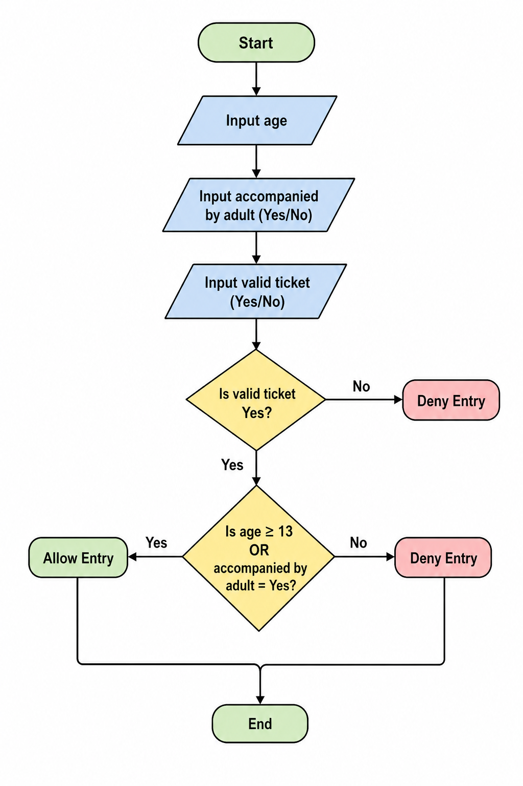

1. Identify the components
1.1 What are the inputs?
The inputs are :
-User age 
-Accompanied by an adult (yes/no)
-Valid ticket

1.2 What is process?
The system checks whether the user is 13 years older, or is accompanied by an adult. It also checks if the user has a valid ticket before allowing entry.

1.3 What is the output?
The output is :
-Allow entry
-Deny entry

2. Design the algorithm 
2.1 Creat the diagram

2.2 Complete the Truth Table
| Age ≥ 13 | Accompanied by Adult | Valid Ticket | Result      |
| -------- | -------------------- | ------------ | ----------- |
| Yes      | Yes                  | Yes          | Allow Entry |
| Yes      | Yes                  | No           | Deny Entry  |
| Yes      | No                   | Yes          | Allow Entry |
| Yes      | No                   | No           | Deny Entry  |
| No       | Yes                  | Yes          | Allow Entry |
| No       | Yes                  | No           | Deny Entry  |
| No       | No                   | Yes          | Deny Entry  |
| No       | No                   | No           | Deny Entry  |

2.3 Design an Algorithm (The Step-by-Step Solution)
1. Start
2. Input age
3. Input accompanied by adult
4. Input valid ticket
5. Check if the ticket is valid
6. Check if the user is 13 years old or older OR 7. accompanied by an adult
7. If true, allow entry
8. Otherwise, deny entry
9. End

2.4 Create Pseudocode

START

INPUT age
INPUT accompanied
INPUT valid_ticket

IF valid_ticket = "Yes" THEN
    IF age >= 13 OR accompanied = "Yes" THEN
        DISPLAY "Allow Entry"
    ELSE
        DISPLAY "Deny Entry"
    ENDIF
ELSE
    DISPLAY "Deny Entry"
ENDIF

END

3. Evaluate Expression
3.1 Test with some input samples

Sample 1:

Age = 15
Accompanied = No
Valid Ticket = Yes
Result = Allow Entry

Sample 2:

Age = 10
Accompanied = Yes
Valid Ticket = Yes
Result = Allow Entry

Sample 3:

Age = 10
Accompanied = No
Valid Ticket = Yes
Result = Deny Entry

Sample 4:

Age = 15
Accompanied = No
Valid Ticket = No
Result = Deny Entry